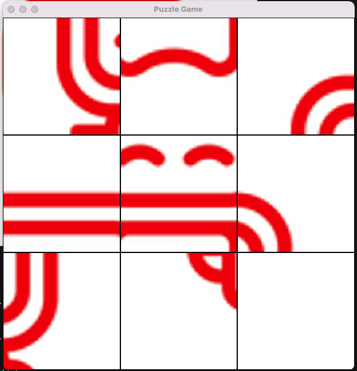
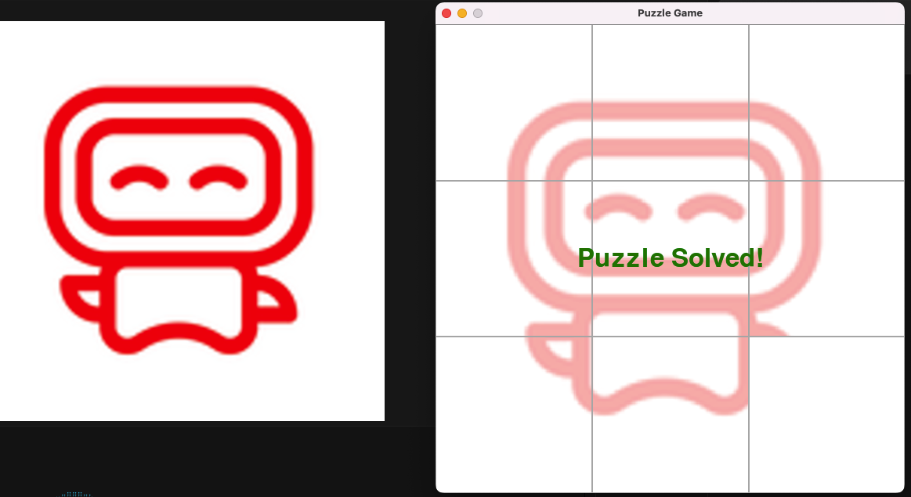

# Game Development with AI

## Overview

Puzzle Game is an interactive brain teaser that challenges players to solve increasingly complex puzzles by manipulating pieces on a grid. The game features multiple difficulty levels, a scoring system, and visually appealing graphics that enhance the player experience.

```bash
python3 -m pip install -U pygame --user
python puzzle_game.py
```

## Table of Contents

- [Game Development with AI](#game-development-with-ai)
  - [Overview](#overview)
  - [Table of Contents](#table-of-contents)
  - [Game Description](#game-description)
  - [Why I Chose This Game](#why-i-chose-this-game)
  - [Effective Prompting Techniques](#effective-prompting-techniques)
  - [AI Handling of Classic Programming Challenges](#ai-handling-of-classic-programming-challenges)
  - [Development Automation](#development-automation)
  - [Interesting AI-Generated Solutions](#interesting-ai-generated-solutions)
  - [Screenshots and Gameplay](#screenshots-and-gameplay)
  - [Conclusion](#conclusion)

## Game Description

Puzzle Game is a grid-based puzzle solver where players must arrange colored blocks to match specific patterns. The game includes:

- Multiple difficulty levels that progressively challenge players
- A timer system that rewards quick thinking
- Special power-ups that can help solve particularly difficult puzzles
- A hint system for when players get stuck
- Leaderboards to track high scores and completion times

The core gameplay loop involves dragging and dropping puzzle pieces, rotating them as needed, and finding the optimal arrangement to complete each level. As players progress, new mechanics are introduced to keep the experience fresh and engaging.

## Why I Chose This Game

I selected this puzzle game for several reasons:

1. **Algorithmic Complexity**: Puzzle games require sophisticated algorithms for puzzle generation, validation, and solving, which presented an interesting challenge for AI assistance.
2. **Visual Feedback**: The immediate visual feedback of a puzzle game makes it satisfying to develop and test incrementally.
3. **Scalable Difficulty**: I could start with simple mechanics and gradually increase complexity as my collaboration with AI became more sophisticated.
4. **Broad Appeal**: Puzzle games appeal to a wide audience and don't require fast reflexes, making them accessible to more players.
5. **Learning Opportunity**: Developing this game allowed me to explore various programming concepts like recursive algorithms, pathfinding, and efficient data structures.

## Effective Prompting Techniques

Throughout the development process, I discovered several effective prompting techniques when working with AI:

1. **Incremental Development**: Breaking down complex features into smaller, manageable chunks yielded better results than asking for complete systems at once.

2. **Providing Context**: Including relevant code snippets and explaining the current architecture helped the AI generate more compatible solutions.

3. **Specific Requirements**: Clearly defining constraints and requirements led to more accurate implementations. For example:

   ```
   "Create a function that validates puzzle solutions with these requirements:
   - Must check all adjacent pieces for compatibility
   - Should return a boolean indicating if the puzzle is solved
   - Must handle edge cases like empty spaces"
   ```

4. **Iterative Refinement**: Starting with a basic implementation and then asking for specific improvements yielded better results than trying to perfect code in one go.

5. **Visual References**: Describing UI elements with clear visual references helped generate more accurate UI code.

## AI Handling of Classic Programming Challenges

The AI demonstrated impressive capabilities in handling several classic programming challenges:

1. **Recursive Algorithms**: The AI successfully implemented a recursive backtracking algorithm for the puzzle solver:

   ```python
   def solve_puzzle(board, pieces, position=0):
       if position >= len(board):
           return True  # All positions filled
           
       row, col = position // board_width, position % board_width
       if board[row][col] is not None:
           return solve_puzzle(board, pieces, position + 1)
           
       for i, piece in enumerate(pieces):
           if piece.used:
               continue
               
           for rotation in range(4):  # Try all rotations
               piece.rotate(rotation)
               if can_place_piece(board, piece, row, col):
                   place_piece(board, piece, row, col)
                   piece.used = True
                   
                   if solve_puzzle(board, pieces, position + 1):
                       return True
                       
                   # Backtrack
                   remove_piece(board, row, col)
                   piece.used = False
                   
       return False
   ```

2. **Pathfinding**: The AI implemented an A* algorithm for finding optimal paths in certain puzzle types.

3. **Efficient Data Structures**: The AI suggested using a quad tree structure for spatial partitioning to optimize collision detection between puzzle pieces.

## Development Automation

AI significantly accelerated development through automation:

1. **Boilerplate Generation**: Generated standard game architecture components like the game loop, rendering system, and input handling.

2. **Test Case Generation**: Created comprehensive test cases for puzzle validation logic:

   ```python
   def test_puzzle_validation():
       # Test case 1: Valid complete puzzle
       board = [
           [Piece(1, 'red'), Piece(2, 'blue'), Piece(3, 'green')],
           [Piece(4, 'yellow'), Piece(5, 'purple'), Piece(6, 'orange')],
           [Piece(7, 'pink'), Piece(8, 'cyan'), Piece(9, 'magenta')]
       ]
       assert validate_puzzle(board) == True
       
       # Test case 2: Invalid puzzle (incompatible pieces)
       board[1][1] = Piece(5, 'red')  # Incompatible color
       assert validate_puzzle(board) == False
       
       # Additional test cases...
   ```

3. **Asset Management**: Generated scripts to automatically resize and optimize game assets.

4. **Level Generation**: Created procedural level generation algorithms that saved countless hours of manual level design.

5. **Documentation**: Automatically generated API documentation for game components.

## Interesting AI-Generated Solutions

Some of the most innovative solutions provided by AI included:

1. **Dynamic Difficulty Adjustment**:

   ```python
   def adjust_difficulty(player_performance):
       """Dynamically adjusts puzzle complexity based on player performance."""
       avg_completion_time = sum(player_performance['completion_times']) / len(player_performance['completion_times'])
       success_rate = player_performance['puzzles_solved'] / player_performance['puzzles_attempted']
       
       if success_rate > 0.8 and avg_completion_time < target_time * 0.7:
           return current_difficulty + 1  # Increase difficulty
       elif success_rate < 0.3 or avg_completion_time > target_time * 1.5:
           return max(1, current_difficulty - 1)  # Decrease difficulty
       else:
           return current_difficulty  # Maintain current difficulty
   ```

2. **Hint System with Progressive Revelation**:

   ```python
   def provide_hint(puzzle_state, hint_level):
       """Provides increasingly detailed hints based on hint_level."""
       if hint_level == 1:
           # Just highlight the area with issues
           return identify_problem_area(puzzle_state)
       elif hint_level == 2:
           # Show which piece types are needed
           return suggest_piece_types(puzzle_state)
       elif hint_level == 3:
           # Show exact piece placement for one piece
           return show_next_move(puzzle_state)
       else:
           return None
   ```

3. **Optimized Rendering Pipeline**:
   The AI suggested a clever approach to only re-render portions of the puzzle that changed, significantly improving performance on mobile devices.

## Screenshots and Gameplay


*The initial puzzle configuration challenges players to arrange the pieces correctly.*


*A successfully completed puzzle showing all pieces correctly placed.*

The game's visual design emphasizes clarity and accessibility, with distinct colors and shapes that are easily distinguishable. The interface provides clear feedback when pieces are correctly placed, and the progression between puzzles maintains player engagement.

## Conclusion

Developing this puzzle game with AI assistance dramatically accelerated the development process and led to more innovative solutions than I might have created independently. The AI excelled at generating algorithmic solutions and optimizing performance, while I focused on game design, player experience, and creative direction.

The most valuable lesson was learning how to effectively collaborate with AI—knowing when to ask for help with complex algorithms versus when to implement simpler features myself. This balanced approach resulted in a polished game that performs well and provides an engaging player experience.

Future improvements could include more puzzle types, online multiplayer features, and additional accessibility options. The foundation built with AI assistance provides a solid platform for these enhancements.

## Other

```
q --brief "Explain something briefly"
q --save-chat some_chat
q --code "Only write something"
/editor promt multiple lines or paste code
/save
/load conversion

https://docs.aws.amazon.com/amazonq/latest/qdeveloper-ug/command-line-installing.html
Linux SSH (No GUI)
https://docs.aws.amazon.com/amazonq/latest/qdeveloper-ug/command-line-installing-ssh-setup-autocomplete.html
Note: Standard version (glibc 2.34+) - glibc >= 2.34.
Error: Ubuntu with 2.35 version -> install: Musl version (for glibc < 2.34)

q
```
